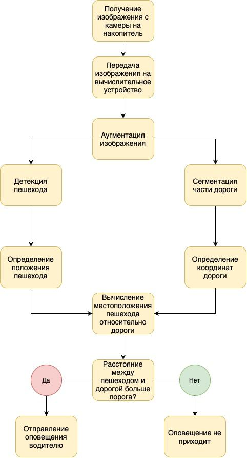
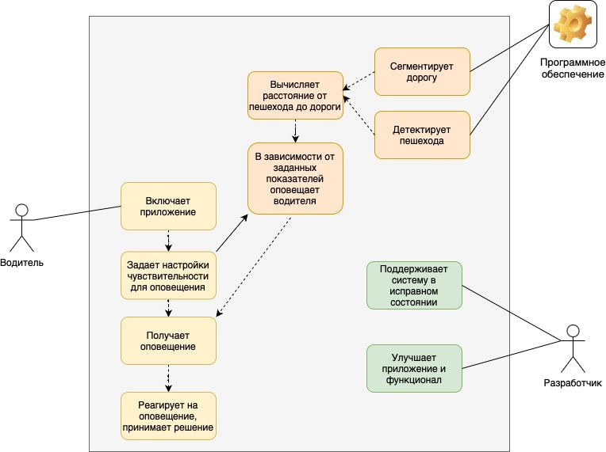
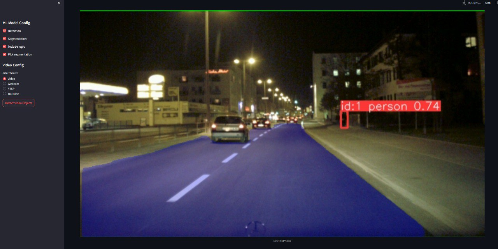
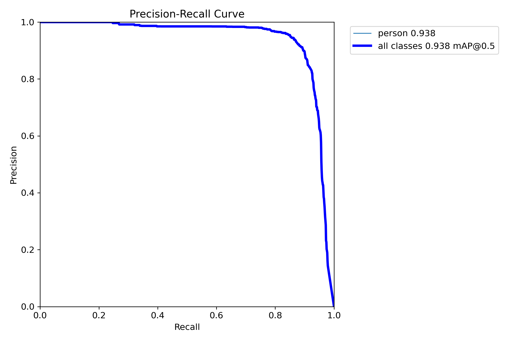

# Система автоматического распознавания пешеходов на дороге в ночное время суток


## Описание проекта
Данный проект нацелен на разработку и внедрение технологий компьютерного зрения для обеспечения безопасности дорожного движения, особенно в условиях ограниченной видимости в темное время суток. Проект предоставит решение для выявления и оповещения о наличии на дороге пешеходов, велосипедистов и мотоциклистов, что способствует уменьшению аварий и смертельных случаев на дорогах. Разработанный пайплайн способен распознавать пешеходов вблизи и на дороге, предупреждая водителя о потенциально аварийных ситуациях.
## Цели проекта
- Увеличение безопасности для пешеходов и водителей в ночное время.
- Предотвращение дорожных происшествий, связанных с наездами на пешеходов.
- Разработка системы, которая работает при ограниченной видимости и в различных погодных условиях.
## Business values
Наш проект представляет собой значительное количество потенциальных бизнес-ценностей:
1. Увеличение безопасности: Улучшение безопасности дорожного движения - это одно из важнейших бизнес-значений. Эта система может снизить количество аварий и наездов на пешеходов, что в свою очередь снизит юридические и финансовые риски для автопроизводителей, владельцев дорог и страховых компаний.
2. Репутация и бренд: Компании, разрабатывающие и внедряющие такие инновационные системы, могут укрепить свою репутацию и бренд, как заботливых и ответственных участников в сфере безопасности и технологических инноваций.
3. Улучшение клиентского опыта: Системы безопасности, внедренные в автомобили, улучшают общий клиентский опыт и комфорт вождения, что может привести к более лояльным клиентам и повторным покупкам.
4. Социальные и общественные выгоды: Повышение безопасности дорожного движения также способствует общественному благополучию, уменьшая травматизм и смертность на дорогах, что может привлечь поддержку со стороны государственных органов и общественности.
5. Возможности для дополнительных услуг: Компании могут предлагать дополнительные услуги и обновления для своих систем распознавания пешеходов, что может приносить дополнительные доходы.

Итак, проект по распознаванию пешеходов на дороге в темное время суток обладает значительным бизнес-потенциалом, предлагая ряд преимуществ, связанных с безопасностью, репутацией  и удовлетворением клиентов, а также социальными и общественными выгодами.

## Диаграммы
### Структура пайплайна


### Диаграмма вариантов использования


## Сравнение инференса
Устройство: Raspberry Pi 4B (8 GB RAM, 1.5 GHz CPU)
| **Framework**       | **Model**    | **Task Type** | **FPS** | **Average inference time, ms** |
|---------------------|--------------|---------------|---------|--------------------------------|
| NCNN                | YOLO v8 nano | detection     | 2.13    | 469                            |
| NCNN                | YOLO v8 nano | segmentation  | 1.66    | 603                            |
| PyTorch             | YOLO v8 nano | detection     | 1.12    | 892                            |
| PyTorch             | YOLO v8 nano | segmentation  | 1.09    | 913                            |
| PyTorch+Torchscript | YOLO v8 nano | detection     | -       | 1322                           |
| ONNX Runtime        | YOLO v8 nano | detection     | -       | 526                            |
| OpenVINO            | YOLO v8 nano | detection     | -       | 1036                           |

В MVP используется NCNN как демонстрирующий наибольшую производительность на ARM.

## Использование
### Требования
* Linux:
1. Docker Engine
2. Git

### Инструкция
1. Clone repository
```
git clone https://github.com/asesorov/EnhancedPedestrianDetection.git
```
2. Build the image
```
docker-compose build
```
3. Run container
```
docker-compose up
```
4. Open URL: http://localhost:8501


## Структура репозитория
- `src` - исходники проекта;
    - `configs` - конфигурационные файлы проекта;
        - `models_configs` - конфигурационные файлы DL-моделей;
            - `samples` - примеры конфигураций моделей;
            - `model_configurator.py` - singleton-класс для доступа к конфигурации в приложении;
        - `schemas` - JSON-схемы для валидации конфигурационных файлов;
        - `logger_conf.py` - конфигурация для логирования;
    - `augmentation` - препроцессинг изображений;
    - `inference` - интерфейсы для инференса DL-моделей;
        - `models` - "врапперы" для использования DL-моделей;
        - `inference_<model>_<framework>` - интерфейс для получения результатов инференса модели в определенном фреймворке;
    - `pipeline` - пайплайн сегментация+детекция;
    - `weights` - основные версии DL-моделей в различных форматах, подобранные в ходе экспериментов;
        - `model name` - основная директория модели;
            - `task type` - segmentation/detection - тип модели;
                - `framework` - модель, сконвертированная в `framework`. Основной фреймворк для инференса: NCNN. Основной фреймворк для тренировки и экспериментов: PyTorch.
    - `utils` - различные инструменты;
    - `train` - включает скрипт для тренировки моделей YOLO с логированием в MLflow и пример конфигурации запуска;
- `docs` - документация и справочная информация по проекту;
- `augment_data.py` - скрипт для автоматизации препроцессинга в DVC;
- `requirements.txt` - необходимые для работы приложения Python-библиотеки;

## Ограничения
[Ограничения](https://github.com/asesorov/EnhancedPedestrianDetection/blob/main/docs/Ограничения.md)

## Данные
Для детекции использовался датасет [NightOwls dataset](https://www.nightowls-dataset.org/)

[Требования к данным для детекции](https://github.com/asesorov/EnhancedPedestrianDetection/blob/main/docs/Требования%20к%20данным.md)

[Инструкция для разметчиков](https://github.com/asesorov/EnhancedPedestrianDetection/blob/main/docs/Инструкция%20для%20разметчиков.md)

[Расчет стоимости](https://github.com/asesorov/EnhancedPedestrianDetection/blob/main/docs/Расчет%20стоимости.md)

## Примеры
### UI


### Кривая Precision-Recall:


## Возможности масштабирования
1. Объединение моделей детекции и сегментации, т.к. обе основаны на YOLOv8n (multi-head);
2. Адаптация для мобильных устройств (переход с Ubuntu aarch64 и Streamlit на Android) - NCNN поддерживает компиляцию под Android с поддержкой Vulkan, что позволит существенно увеличить производительность;
3. Расширение вариантов использования: помимо ночного времени суток, улучшить детектор для различных погодных условий (дождь, туман и т.д.);
4. Для городских условий целесообразно добавить возможность переноса инференса на удаленный сервер с целью использования более сложных моделей детекции и ML-алгоритмов улучшения качества изображения;
